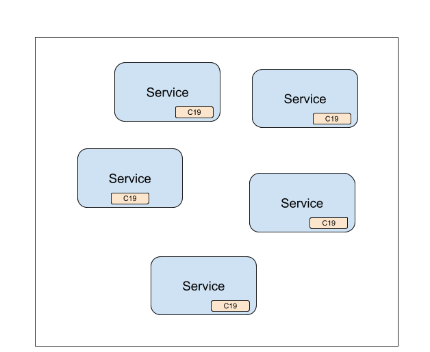

# The C19 Protocol
### A Distributed Shared State for Kubernetes (and more)

The C19 protocol allows you to easily share data (state) across a set of pods. It allows a group of services to agree on a service-wide state.
The data becomes available locally to your service.



C19 decouples the process of fetching the data from using it. Consider a case of two or more microservices with different dependencies. 
A dependant service would have to handle fetching the data from other services. It has to consider cases of latency and unavailability. 
But fetching the data is not its main focus and should not be its main concern. By decoupling fetching the data from using it, C19 makes sure 
the data is available locally to the service. 

C19 is a simple, powerful and extensible system and can reduce the complexities by taking care of fetching the data and making it available locally to your services.

## The Books
The best and most extensive source of information is the [User Guide]. Please read it!
It has anything from a step by step guide for running the C19 protocol to a drill down on architecture.

[The User Guide]

And we have a second book ready if you wish to contribute to the C19 project.

[The Developer Guide]

## A Very Quick Start
The following Kubernetes configuration files will deploy a cluster of Nginx pods with an attached c19 agent for each one. You can then explore the way data is shared across 
your pods and how it becomes available locally to the Nginx service.

To attach a C19 agent to your Nginx deployment, you will need two files:
1. A configmap that will hold your C19 configuration. You can read about the C19 configuration [here].
2. A Kubernetes deployment file.

### 1. Configmap
```yaml
apiVersion: v1
kind: ConfigMap
metadata:
  name: c19-getting-started-config
immutable: true
data:
  config.yaml: |
    version: 0.1
    spec:
      agent:
        kind: Default
        port: 3097
      state:
        kind: Default
        ttl: null
        purge_interval: 60000
      connection:
        kind: Default
        port: 4097
        push_interval: 1000
        pull_interval: 60000
        r0: 3
        timeout: 1000
        peer_provider:
          kind: K8s
          selector:
            c19: getting-started
          namespace: default
```

Save this as `configmap.yaml` file and apply it to the cluster like so:
```shell
kubectl apply -f configmap.yaml
```

[Configuring the Agent]: getting-started-configuration.md

### 2. Deployment File
```yaml
apiVersion: apps/v1
kind: Deployment
metadata:
  name: nginx-deployment
  labels:
    app: nginx
spec:
  replicas: 3
  selector:
    matchLabels:
      app: nginx
  template:
    metadata:
      labels:
        app: nginx
        c19: getting-started
    spec:
      containers: - name: nginx image: nginx:1.14.2
        ports:
        - containerPort: 80
      - name: c19
        image: c19p/c19:0.1.0
        args: ["/usr/local/bin/c19", "--config", "/etc/c19/config.yaml"]
        ports:
          - name: agent
            containerPort: 3097
            protocol: TCP
          - name: connection
            containerPort: 4097
            protocol: TCP
        volumeMounts:
          - name: c19
            mountPath: /etc/c19
      volumes:
        - name: c19
          configMap:
            name: c19-getting-started-config
```

Save this as `deployment.yaml` file and apply it to the cluster like so:
```shell
kubectl apply -f deployment.yaml
```

**That's it! Your C19 powered Nginx is now deployed to Kubernetes and is ready to be used.**

At this point the c19 agent is available locally to your Nginx application. Nginx can access the c19 agent using HTTP calls to get and set values to and from the state.

To explore how to do that, please refer to the [Testing the Deployment] section in the user guide.

For a step-by-step guide to what happened above, please refer to the [Getting Started] section.

## Kubernetes
While the title of this README says "A Distributed Shared State **for Kubernetes**", it's actually not a must. C19 can be deployed anywhere and is not tightly 
coupled to a Kubernetes cluster. We find targeting Kubernetes as most appealing to the community and answers most use cases.

Please refer to the [Non-Kubernetes Deployment] section in the user guide to explore a non-Kubernetes deployment.

## How Does it Work?
A common question is how data is shared across the c19 agents. What is the consistency of the system, performance, durability and how conflicts are resolved.

To answer those questions one must understand how a c19 agent works. It is composed of three layers: `State`, `Agent` and `Connection`.
- The `Agent` layer is responsible for communicating with your app. It exposes ways for your app to set and get values to and from the state.
- The `State` layer is responsible for holding and managing your data.
- The `Connection` layer is responsible for distributing your data across the c19 cluster.

If you look through the example configuration [above](#1.-configmap), you can see that each layer has a `kind` configuration. This means that different 
layer implementations can be used and configured and this affects the consistency, durability and performance of the system.

At the time of writing there are only the default implementations for each layer. The `Default` layers guarantee the following:
- `Consistency` - The data spreads across the system in a [Gossip] like way. Some call is convergence consistency.
- `Durability` - The data is shared (duplicated) across the c19 agents so you have full redundancy.
- `Performance` - This one is hard to tell since it depends on how you configure your `Connection` layer. Your configuration and size 
of data affects the rate in which the data is shared across the system. To get the most reliable metrics you will have to benchmark this yourself.
- `Conflict Resolution` - The `Default` state layer implementation resolves conflicts by considering the time (in milliseconds resolution) for when a key 
was created. If two c19 agents try to update a third one with different versions of a key, the one that is newer will be chosen.

You are encouraged to read more about the how the default layer implementations work in the [Architecture] section.

[Appendix I] lists the available layer implementations you can choose from. You are welcome to visit this page from time to time as we expect it 
to grow and offer different implementations to answer a wide range of use cases.

## Motivation and Use Cases
The [Motivation] and [Use Cases] section on the user guide will guide you through our reasoning and the different use cases we believe can be solved by the C19 protocol.

## Contributing
Every contribution matters! And we greatly appreciate any help in improving and extending the C19 protocol. Please refer to the [Contributing](CONTRIBUTING.md) file in this repository or the 
[Contributing] section on the [Developer Guide].

## License
BSD-3-Clause.

[The User Guide]: https://c19p.github.io/user-guide/title-page.html
[User Guide]: https://c19p.github.io/user-guide/title-page.html
[The Developer Guide]: https://c19p.github.io/developer-guide/
[Developer Guide]: https://c19p.github.io/developer-guide/
[Deployment Strategies]: https://c19p.github.io/user-guide/deployment-strategies.html
[Getting Started]: https://c19p.github.io/user-guide/ch01-00-getting-started.html
[Contributing]: https://c19p.github.io/developer-guide/contributing.html
[Motivation]: https://c19p.github.io/user-guide/motivation.html
[Use Cases]: https://c19p.github.io/user-guide/use-cases.html
[here]: https://c19p.github.io/user-guide/getting-started-configuration.html
[Testing the Deployment]: https://c19p.github.io/user-guide/getting-started-test-deployment.html
[Non-Kubernetes Deployment]: https://c19p.github.io/user-guide/getting-started-non-kubernetes-deployment.html
[Gossip]: https://en.wikipedia.org/wiki/Gossip_protocol
[Architecture]: https://c19p.github.io/user-guide/architecture.html
[Appendix I]: https://c19p.github.io/user-guide/appendix-i.html
